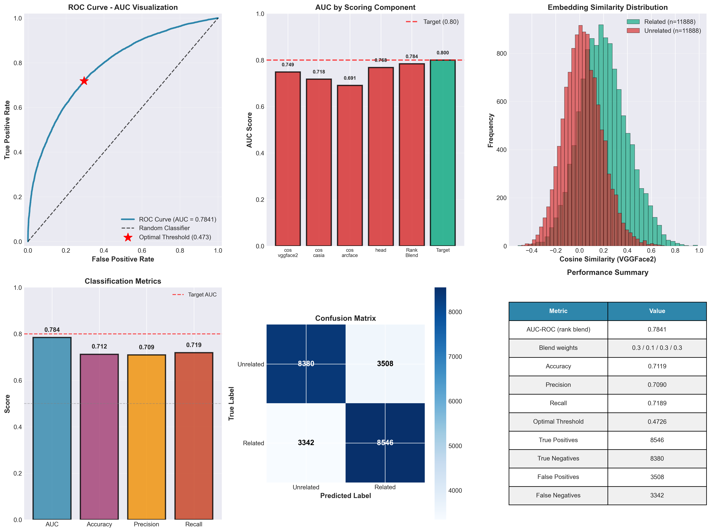

# Recognizing Faces in the Wild (FIW)


Kinship verification from facial images using a Siamese convolutional neural network trained on the [Families in the Wild](https://www.kaggle.com/c/recognizing-faces-in-the-wild) dataset from Northeastern University's SMILE Lab.

Given a pair of face images, the model predicts the probability that the two individuals are related.

## Motivation

This project explores a core challenge in computer vision: can a neural network learn to recognize familial resemblance from unconstrained face images? Beyond the Kaggle competition, it serves as a case study in deliberate, iterative model development — evolving from a naive 2-layer CNN (v0.1) to a fine-tuned FaceNet backbone (v0.6) through a series of principled improvements:

- **v0.1** — Baseline Siamese CNN with a 2K-pair subsample
- **v0.2–v0.3** — Fixed inverted contrastive loss, added reproducibility seeds, cross-platform support
- **v0.4** — Added proper evaluation metrics (AUC-ROC, Youden's J threshold)
- **v0.5** — Scaled to full dataset with family-aware splits to eliminate data leakage
- **v0.6** — Pretrained FaceNet backbone with selective fine-tuning and data augmentation

Each version addressed a specific weakness exposed by the previous iteration. The full history is in the [CHANGELOG](CHANGELOG.md).

## Results



Measured on the held-out test split (21,674 pairs: 10,837 related + 10,837 unrelated, from families unseen during training):

| Metric | Value |
|--------|-------|
| **AUC-ROC** | 0.674 |
| **Accuracy** | 0.626 |
| **Precision** | 0.631 |
| **Recall** | 0.605 |
| **Threshold Selection** | Youden's J statistic (0.448) |
| **Training Pairs** | ~216K balanced (108K related + 108K unrelated) |
| **Training Time** | ~12 min (GPU T4) / ~35 min (CPU) |

Related and unrelated pairs separate in the expected direction — related pairs have lower mean embedding distance — but the distributions overlap substantially, which is what the 0.674 AUC reflects. The operating point is selected via Youden's J on the ROC curve. The project's original success criterion of AUC ≥ 0.80 has not been met.

## Architecture

A Siamese network with shared weights uses a pretrained InceptionResnetV1 (FaceNet, VGGFace2) backbone with frozen early layers and fine-tuned last 2 blocks (repeat_3, block8), followed by a fully connected head (512→128) to produce a 128-dimensional embedding. Pairs are compared via Euclidean distance and trained with contrastive loss.

- **Input**: 112x112 RGB face images
- **Backbone**: InceptionResnetV1 (pretrained on VGGFace2) with selective fine-tuning
- **Training**: ~216K balanced pairs (108K related + 108K unrelated), family-aware 70/15/15 split
- **Data Augmentation**: Random horizontal flip, rotation (+-10 deg), color jitter
- **Optimizer**: Adam (lr=0.0001), 10 epochs, batch size 64

### Key Engineering Decisions

- **Family-aware splits** prevent data leakage — no family appears in more than one split, ensuring the model generalizes to unseen families rather than memorizing individuals
- **Transfer learning with selective fine-tuning** — freezing early FaceNet layers preserves general face features while fine-tuning the last 2 blocks adapts to kinship-specific patterns
- **Balanced pair generation** — equal positive/negative sampling prevents the model from exploiting class imbalance

## Quick Start

### Prerequisites

- Python 3.11. On macOS, install it with `brew install python@3.11`.
- A [Kaggle API key](https://www.kaggle.com/docs/api) at `~/.kaggle/kaggle.json`

### Run

```bash
# Interactive Jupyter session
./run.sh

# Headless execution
./run.sh --headless
```

The script creates a virtual environment, installs dependencies (`torch`, `torchvision`, `pandas`, `scikit-learn`, `matplotlib`, `kaggle`, `jupyter`, `facenet-pytorch`), and launches the notebook.

### Run on Kaggle

For cloud execution with free GPU, see the [Kaggle Setup Guide](KAGGLE_SETUP.md) or open `kaggle.ipynb` directly in a Kaggle Notebook.

## Pipeline

1. **Download** — Fetches competition data via the Kaggle API
2. **Clean** — Loads `train_relationships.csv`, removes pairs with missing image data (1,108 of 3,598 removed)
3. **Split** — Family-aware 70/15/15 split (no family leaks across splits), balanced positive/negative pairs
4. **Train** — Siamese network with contrastive loss for 10 epochs
5. **Evaluate** — AUC-ROC, accuracy, precision, recall at optimal threshold (Youden's J); ROC curve and distance distribution plots
6. **Submit** — Generates `submission.csv` with pairwise relatedness probabilities for all ~11.8M test pairs

## Project Structure

```
main.ipynb              # End-to-end pipeline (download -> train -> evaluate -> submit)
kaggle.ipynb            # Cloud-optimized variant for Kaggle Notebooks
run.sh                  # Setup and launch script
extract_metrics.py      # Standalone metrics extraction from trained model
visualize_auc.py        # Generates AUC visualization dashboard
quick_verify.py         # Component verification (model, loss, metrics)
requirements.txt        # Python dependencies
```

## Citations

Per the [competition rules](https://www.kaggle.com/competitions/recognizing-faces-in-the-wild/rules#7-competition-data), usage of FIW data should cite:

> Robinson, J.P., Shao, M., Liu, H., Wu, Y., Gillis, T., & Fu, Y. "Visual Kinship Recognition of Families In the Wild." *IEEE TPAMI Special Edition: Computational Face* (2018).
>
> Robinson, J.P., Shao, M., Zhao, H., Wu, Y., Gillis, T., & Fu, Y. "Recognizing Families In the Wild (RFIW): Data Challenge Workshop in conjunction with ACM MM 2017." *ACM Multimedia Conference: Workshop on RFIW* (2017).
>
> Wang, S., Robinson, J.P., & Fu, Y. "Kinship Verification on Families in the Wild with Marginalized Denoising Metric Learning." *IEEE Automatic Face and Gesture Recognition* (2017).
>
> Robinson, J.P., Shao, M., Wu, Y., & Fu, Y. "Families In the Wild (FIW): Large-Scale Kinship Image Database and Benchmarks." *ACM on Multimedia Conference* (2016).

## License

[MIT](LICENSE)
